# authgent — Visual Architecture & Flow Diagrams

## What Is authgent?

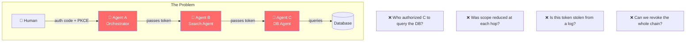

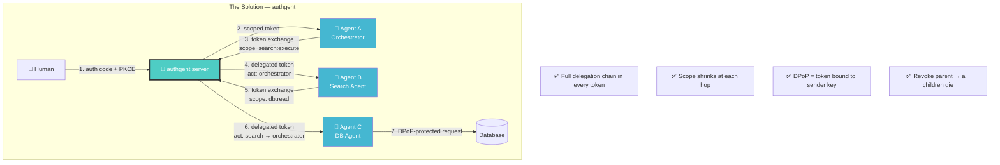

---

## System Architecture

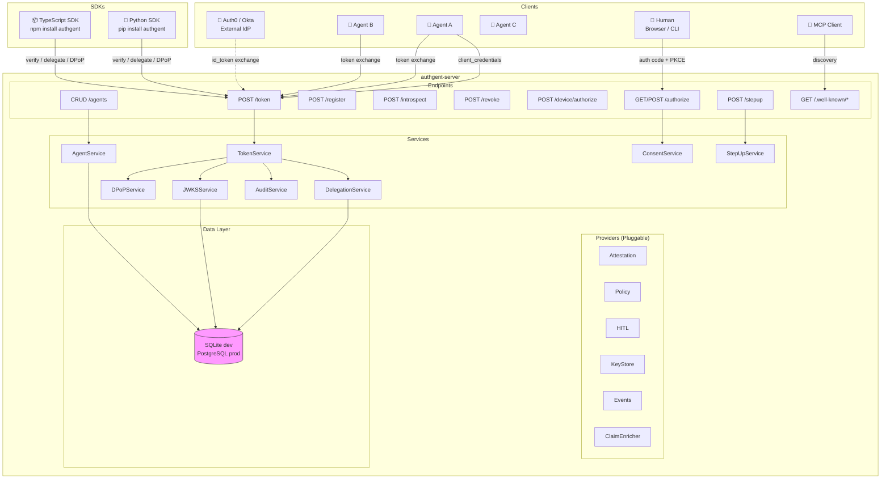

---

## Flow 1: Agent Gets Its Own Token (Client Credentials)

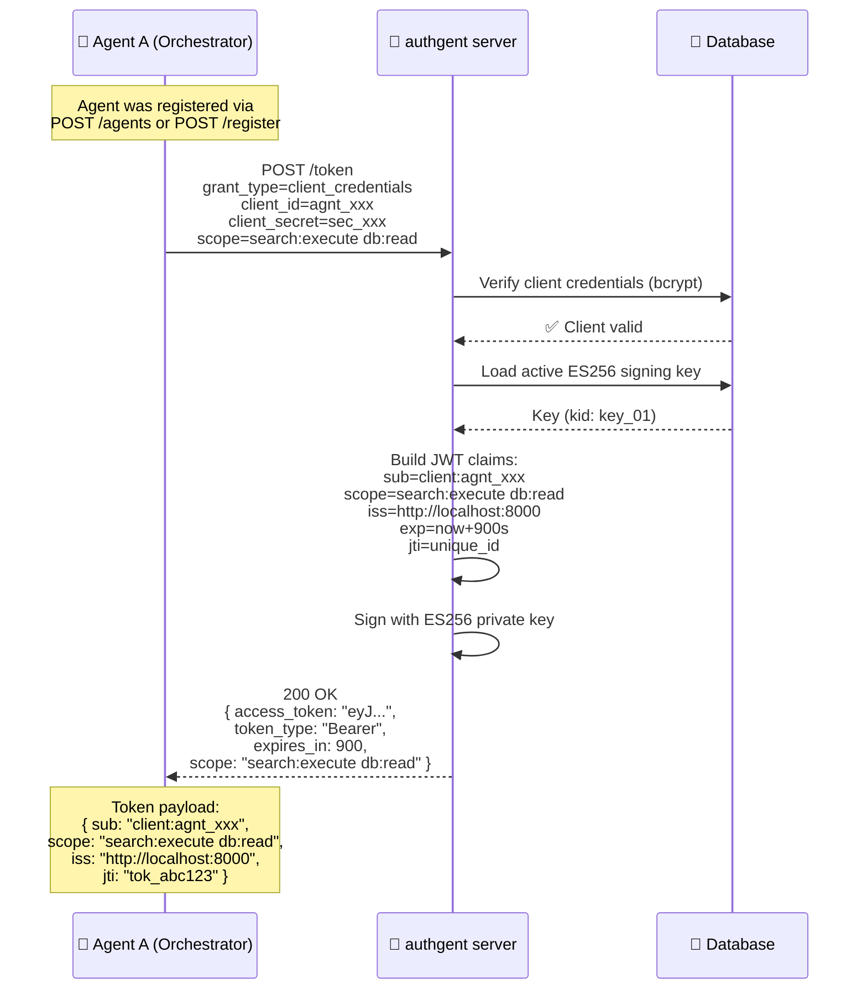

---

## Flow 2: Agent Delegates to Another Agent (Token Exchange)

This is **the core differentiator** — what nobody else does.

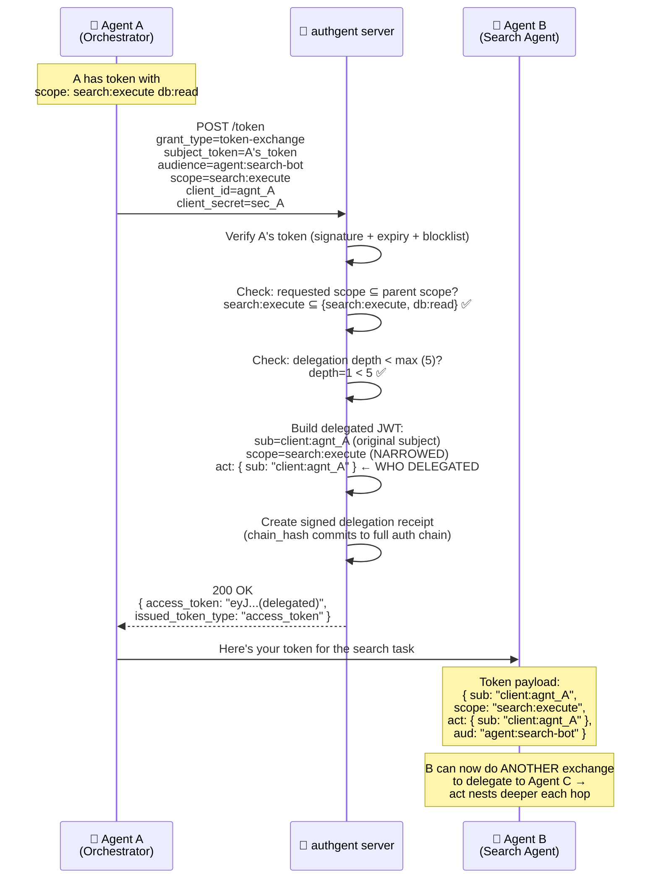

---

## Flow 3: Multi-Hop Delegation Chain (3 Agents Deep)

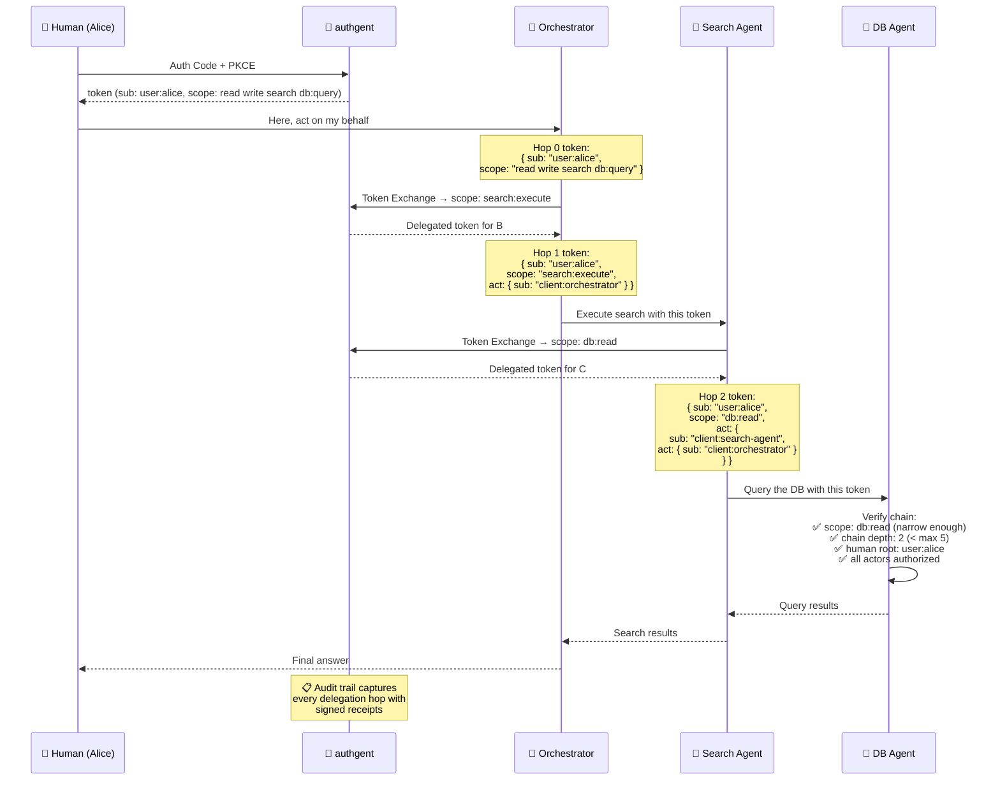

---

## Flow 4: DPoP — Token Can't Be Replayed from Logs

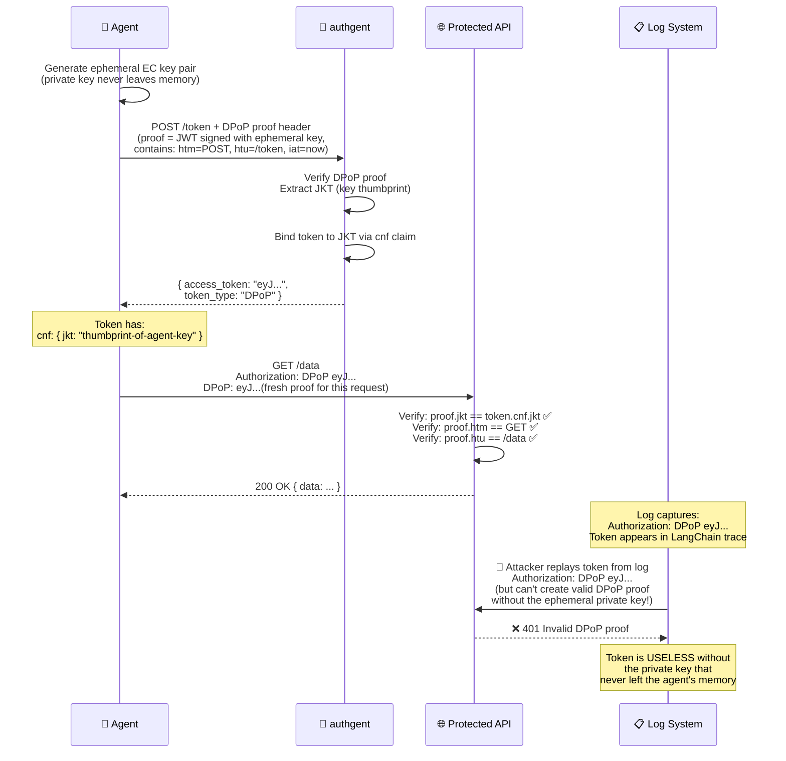

---

## Flow 5: Human-in-the-Loop Step-Up Authorization

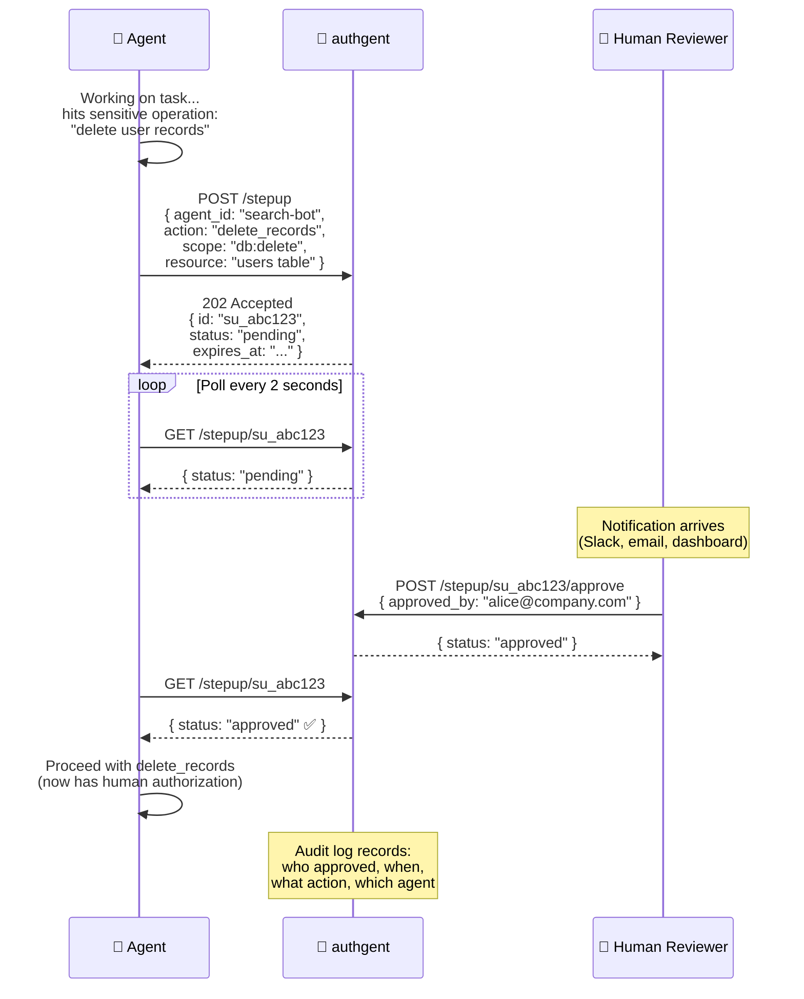

---

## Flow 6: Device Authorization (Headless / CLI Agents)

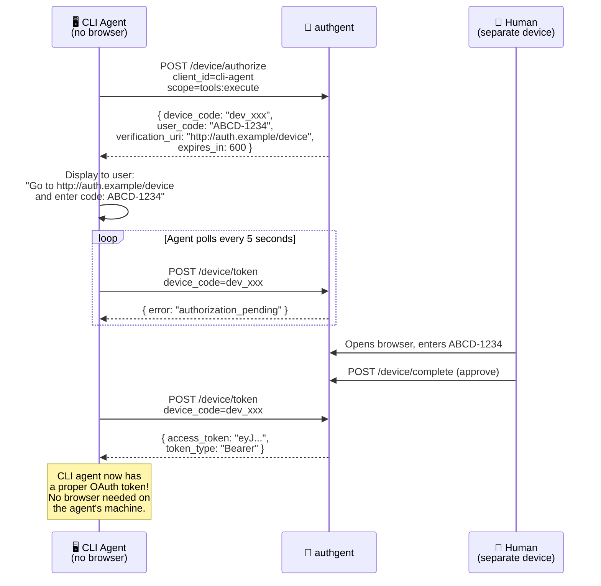

---

## Flow 7: Bridge from Auth0/Okta (External IdP Token Exchange)

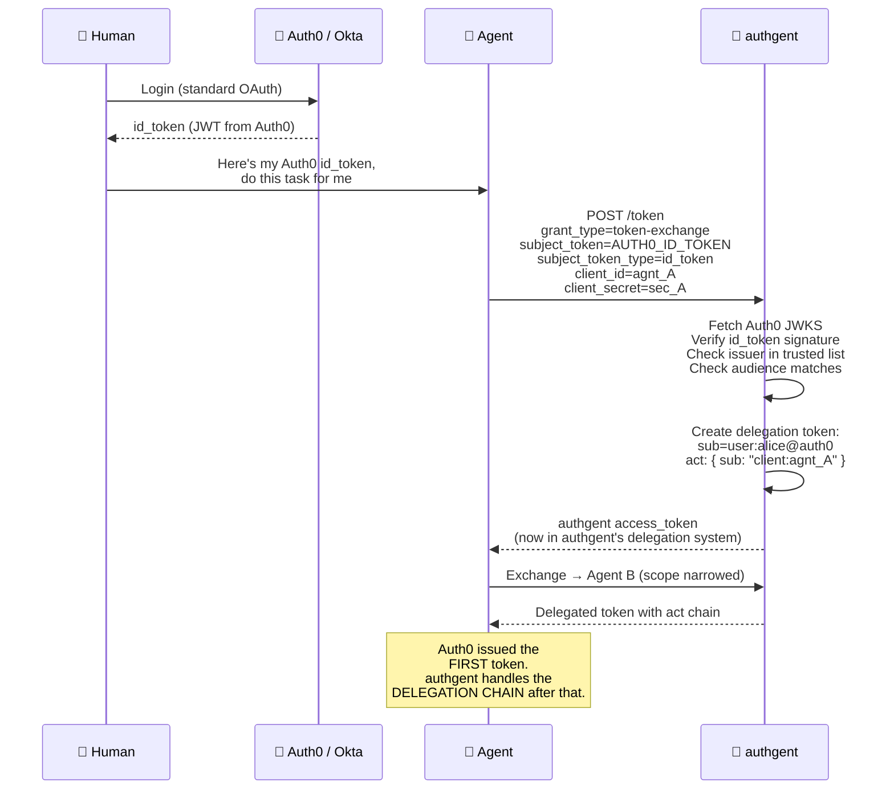

---

## Token Anatomy (What's Inside Each JWT)

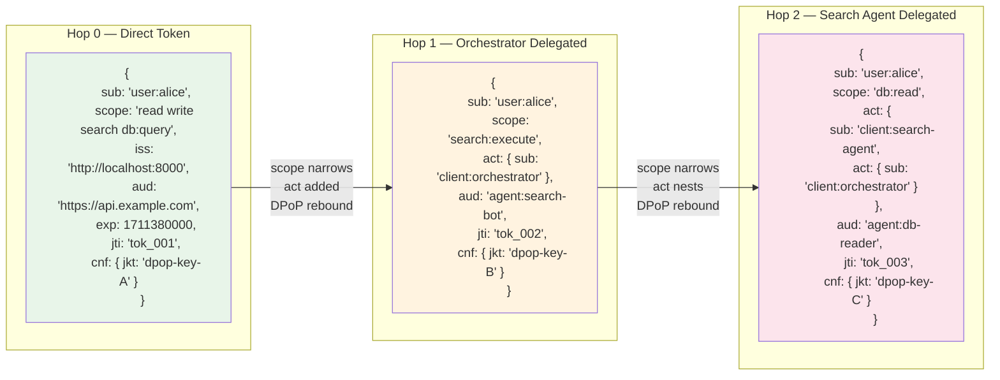

---

## Signed Delegation Receipts (Chain Splicing Defense)

```mermaid
graph TD
    subgraph "Normal Chain"
        R1[Receipt 1<br/>chain_hash: H₁<br/>parent: tok_001<br/>child: tok_002]
        R2[Receipt 2<br/>chain_hash: H₂ = SHA256{H₁ + tok_002}<br/>parent: tok_002<br/>child: tok_003]
        R1 --> R2
    end

    subgraph "🔴 Splice Attack"
        EVIL[Attacker takes tok_002<br/>from Chain X and tries<br/>to use it in Chain Y]
        EVIL -->|"chain_hash won't match!"| FAIL[❌ Receipt verification<br/>FAILS — chain_hash<br/>doesn't match Y's history]
    end

    subgraph "Verification"
        V[Verifier recomputes:<br/>expected_hash = SHA256{prev_receipt + parent_jti}<br/>actual_hash from receipt<br/>MUST MATCH]
    end

    style FAIL fill:#ff6b6b,color:#fff
    style V fill:#4ecdc4,color:#fff
```
